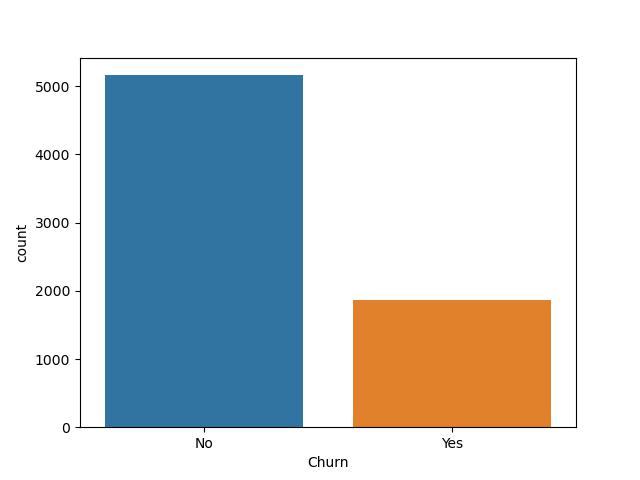
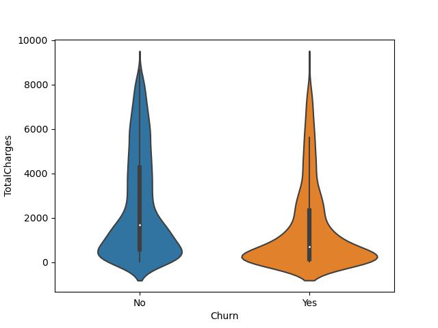
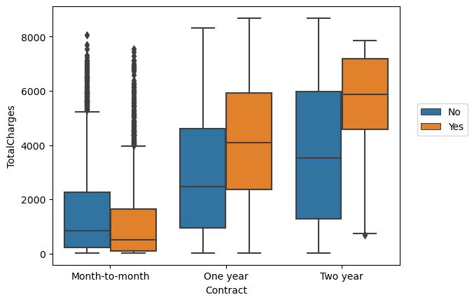
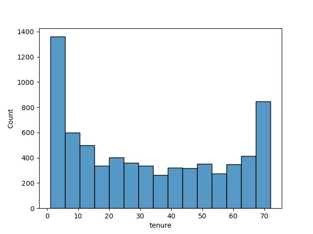
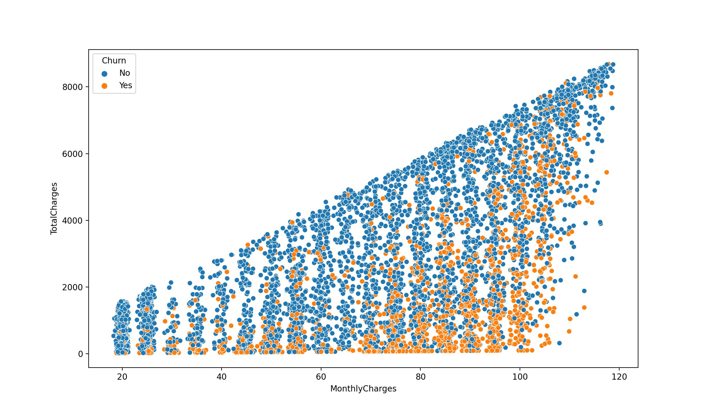
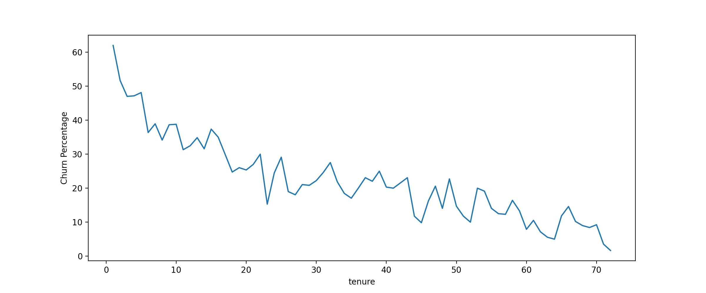
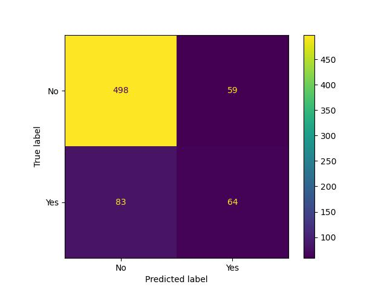
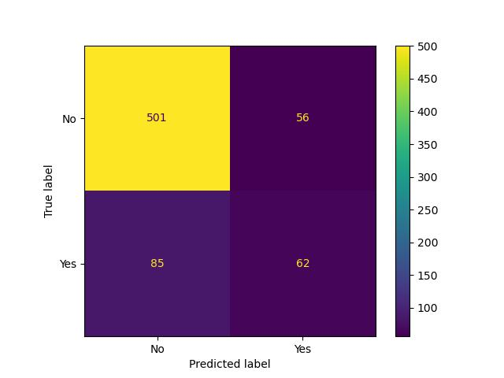

# Telco_Customer_Churn_Prediction

This project aims at predicting whetehr a customer will continue eith the Telco Service group or not. To classify the customers, the analysis is divided into three stages:
  * Exploratory Data Analysis
  * Cohort Data Analysis
  * Prediction Model (Decision Trees & Random Forests)

# Exploratory Data Analysis

Churn Countplot:

  

Distrubution of TotalCharges between Churn categories:

  

Total Charges Vs Contract Type

  

# Churn Analysis:
Tenure Countplot:

  

Total Charges vs Monthly Charges

  

Churn Percentage vs Tenure

  

Creating Tenure Cohort based on the below conditions:
   * '0-12 Months'
   * '12-24 Months'
   * '24-48 Months'
   * 'Over 48 Months' 

Tenure Cohort

  

Tenure Cohort Countplot

  

# Prediction Model

Decision Trees: 
* Confusion Matrix

  

Random Forests:
* Confusion Matrix

  

# Final Thoughts:
The accuracy of both the models was 80%.
The precision and recall for churn yes and churn no were 53%,42% and 85%,90% respectively.
The imbalance in the churn class could be the main reason for the difference in the precision and recall values for the churn classes.
The performance can be improved by training the model on an improved well balanced data set. 

